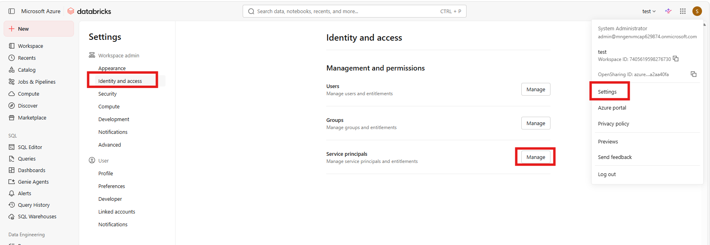
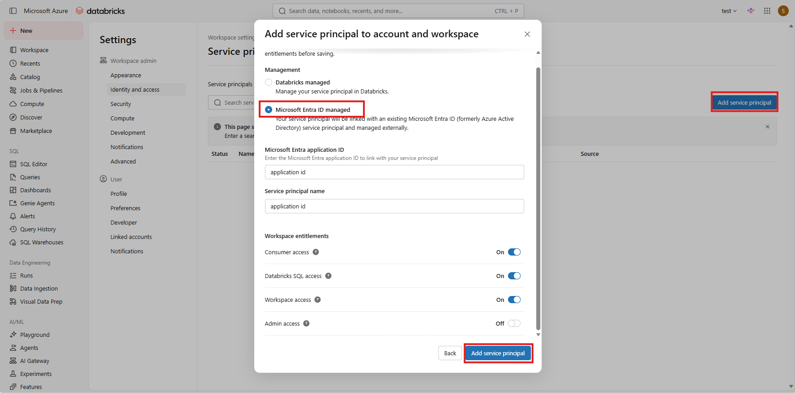
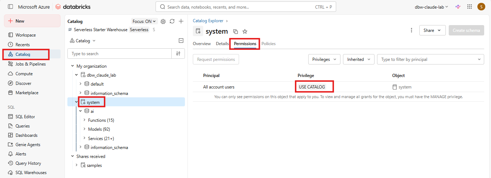
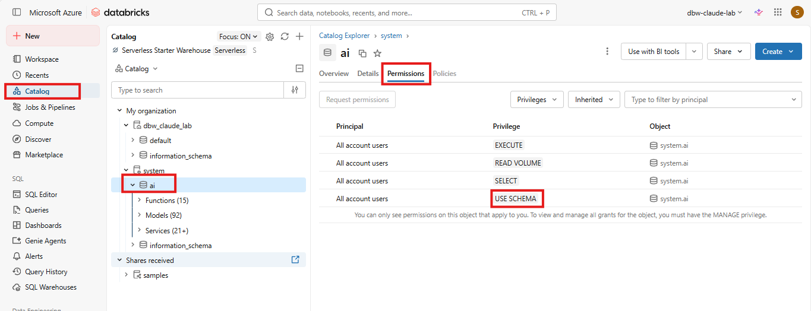
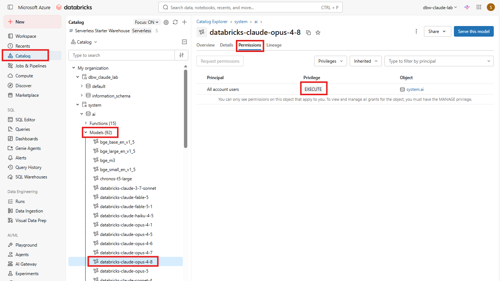

# Azure Databricks Claude 고객 설정 가이드

이 문서는 Korea Central에 신규 구축한 Claude 전용 Standard v2 APIM을 기존 Azure Databricks
workspace의 `system.ai` Claude 모델과 연결할 때 고객 관리자가 코드 배포 외에 수행할 작업을
정리합니다.

Terraform 배포와 Workbook 검증은
[Claude Standard v2 APIM 구축 가이드](claude-standard-v2-deployment.md), 최종 사용자 설정은
[README](../README.md#claude-code)를 사용합니다.


## 작업 요약

| 담당 | 작업 |
|---|---|
| Azure/APIM 운영자 | Standard v2 Terraform apply와 신규 APIM identity 전달 |
| Databricks 관리자 | 신규 APIM application ID를 Service Principal로 등록하고 Claude 권한 부여 |
| 사용자 지원 | Claude Code의 `ANTHROPIC_BASE_URL`만 신규 URL로 변경 |

## 1. APIM identity 값 확인

```bash
principalId="$(terraform -chdir=infra/environments/claude-standard-v2 \
  output -raw apim_managed_identity_principal_id)"

applicationId="$(az ad sp show \
  --id "$principalId" \
  --query appId \
  --output tsv)"

printf 'PrincipalId: %s\nApplicationId: %s\n' "$principalId" "$applicationId"
```

| 값 | 용도 |
|---|---|
| `principalId` | Azure RBAC용 Microsoft Entra object ID |
| `applicationId` | Databricks에 등록할 Microsoft Entra application/client ID |

신규 Standard v2 APIM은 기존 Classic APIM과 다른 identity입니다. 기존 APIM의 Databricks
Service Principal 등록을 자동으로 재사용할 수 없습니다.

## 2. Databricks Service Principal 등록

Databricks Account Admin 또는 Workspace Admin이 다음을 수행합니다.

1. 고객 Azure Databricks workspace에 로그인합니다.
2. **Settings** > **Identity and access** > **Service principals** > **Manage** 를 선택합니다.



3. **Add service principal** > **Add new**를 선택합니다.
4. 관리 유형으로 **Microsoft Entra ID managed**를 선택합니다.
5. 앞 단계의 `applicationId`를 입력합니다.
6. Claude Standard v2 APIM임을 구분할 수 있는 이름을 입력합니다.
7. workspace assignment/access를 활성화합니다.



Databricks account에 Service Principal을 생성하는 것만으로는 충분하지 않습니다. 대상
workspace의 Service principals 목록에도 같은 `applicationId`가 표시되고, 최소한
`workspace-access` entitlement가 활성화되어야 합니다. account 등록만 있고 workspace 할당이
없으면 Databricks가 Entra token을 수락한 뒤에도 모델 호출은 `403 User not authorized`로
실패합니다. 기존 운영 principal과 동일하게 SQL 기반 권한 확인이 필요하면
`databricks-sql-access`도 활성화합니다.

Azure subscription의 `Contributor` 역할만 부여해서는 Databricks data plane 등록을 대체할 수
없습니다.

## 3. Claude model 권한

workspace 기본 정책으로 system model 호출이 허용되면 아래의 권한이 자동으로 부여됩니다.

- `USE CATALOG` on `system`
- `USE SCHEMA` on `system.ai`
- 실제 사용할 Opus, Sonnet, Haiku, Fable model service의 `EXECUTE`





APIM policy는 다음 family prefix를 허용합니다.

```text
system.ai.claude-opus-*
system.ai.claude-sonnet-*
system.ai.claude-haiku-*
system.ai.claude-fable-*
```

새 model version은 APIM policy 배포 없이 사용할 수 있지만, Databricks 권한은 새 model
service에도 필요할 수 있습니다.

Fable 5와 Fable 5.1은 Anthropic의 trust and safety 목적으로 prompt와 response가 30일 보존될
수 있습니다. APIM의 prompt/response logging 비활성화와 별개의 upstream 처리 조건이므로
고객의 데이터 보존·컴플라이언스 승인을 확인한 뒤 활성화합니다.

## 4. 네트워크 설정

대상 workspace는 public network access가 활성화되어 있고 Private Endpoint와 workspace IP
access list가 없으므로 Databricks 측 network allowlist 작업은 없습니다. APIM은 전용 NAT를
통해 public workspace URL을 호출하지만 현재 구성에서는 NAT public IP를 Databricks에 별도로
등록하지 않습니다.

향후 workspace IP access list를 활성화한다면 Terraform output `nat_gateway_public_ip`를
allowlist에 추가합니다.

## 5. 연결 검증

고객 작업 완료 후 APIM을 다시 apply할 필요는 없습니다. APIM 운영자가 같은 Managed Identity로
호출을 재시도합니다.

| 결과 | 확인할 항목 |
|---|---|
| APIM `401` | Keycloak issuer/audience/scope/role |
| APIM `403` | 요청 model prefix |
| Databricks `401` | application ID가 Databricks SP로 등록됐는지 |
| Databricks `403` | workspace assignment와 model `EXECUTE` |
| backend timeout/TLS 오류 | Databricks public endpoint, DNS와 account-level ingress policy |
| `count_tokens` `404` | 정상 제약; Claude Code inference fallback 사용 |

고객 환경에서 제공하기로 한 Opus, Sonnet, Haiku, Fable 호출은 각각 `200`이어야 하며 SSE도
정상 종료되어야 합니다. 이후 운영자는
[배포 가이드의 token logging 검증](claude-standard-v2-deployment.md#8-token-logging-검증)을
완료하고 사용자에게 `claude_gateway_base_url`을 전달합니다.

## Microsoft 공식 문서

- [Databricks Service Principal 관리](https://learn.microsoft.com/azure/databricks/admin/users-groups/manage-service-principals)
- [Databricks model service 권한](https://learn.microsoft.com/azure/databricks/ai-gateway/create-model-services)
- [Databricks Anthropic Messages API](https://learn.microsoft.com/azure/databricks/machine-learning/model-serving/query-anthropic-messages)
- [Databricks IP access list](https://learn.microsoft.com/azure/databricks/security/network/front-end/ip-access-list)
- [Databricks Private Link 개념](https://learn.microsoft.com/azure/databricks/security/network/concepts/privatelink-concepts)
- [APIM Managed Identity 정책](https://learn.microsoft.com/azure/api-management/authentication-managed-identity-policy)
- [Standard v2 outbound VNet integration](https://learn.microsoft.com/azure/api-management/integrate-vnet-outbound)
- [Databricks Claude Fable 5 및 5.1](https://learn.microsoft.com/azure/databricks/machine-learning/foundation-model-apis/supported-models#anthropic-claude-fable-51)
