# Keycloak Admin Console에서 APIM Gateway 연동하기

이 문서는 고객의 기존 Keycloak realm, 사용자, 그룹을 유지하면서 Azure API Management(APIM)
LLM Gateway에 필요한 OIDC 구성을 추가하는 절차입니다. 화면은 Keycloak 26.7.0 테스트 realm에서
캡처했습니다. 고객 환경에서는 realm과 client 이름을 조직 표준에 맞게 변경할 수 있지만,
Keycloak 토큰과 APIM 정책의 값은 반드시 서로 일치해야 합니다.

> 캡처 화면의 노란색 임시 관리자 경고는 테스트 환경에만 해당합니다. 운영 환경에서는 영구
> 관리자 계정을 사용하고 bootstrap 관리자 계정을 제거합니다.

## 구성값

| 용도 | 이 가이드의 값 |
|---|---|
| API audience/client | `llm-gateway-api` |
| Gateway 사용 권한 | `invoke` |
| 요청할 client scope | `llm-gateway` |
| CLI public client | `llm-gateway-cli` |
| 역할 claim | `llm_gateway_roles` |
| CLI 요청 scope | `openid llm-gateway` |

## 1. 대상 realm 선택

Admin Console에 로그인하고 고객 사용자가 존재하는 realm을 선택합니다. `master` realm에 구성하지
않습니다.

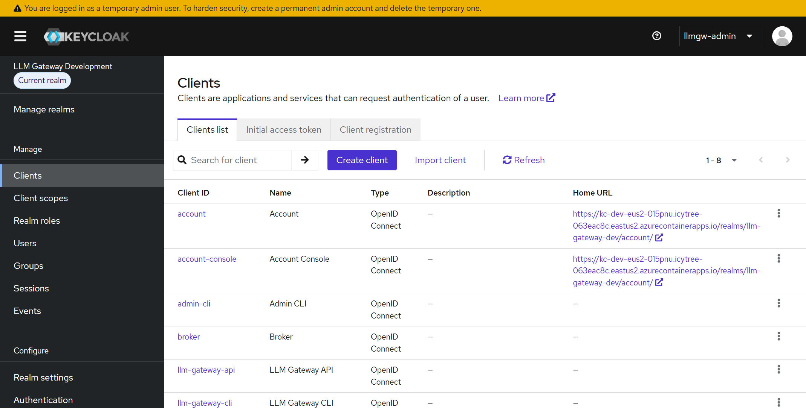

## 2. API client와 역할 생성

**Clients → Create client**에서 다음 client를 생성합니다.

| 항목 | 값 |
|---|---|
| Client type | `OpenID Connect` |
| Client ID | `llm-gateway-api` |
| Name | 설명용 이름, 예: `LLM Gateway API` |

이 client는 사용자 로그인용이 아니라 API audience와 client role의 namespace로 사용합니다.
APIM은 이 client의 secret을 사용하지 않습니다. 사용하지 않는 로그인 grant는 비활성화하고,
client secret을 APIM이나 최종 사용자에게 전달하지 않습니다.

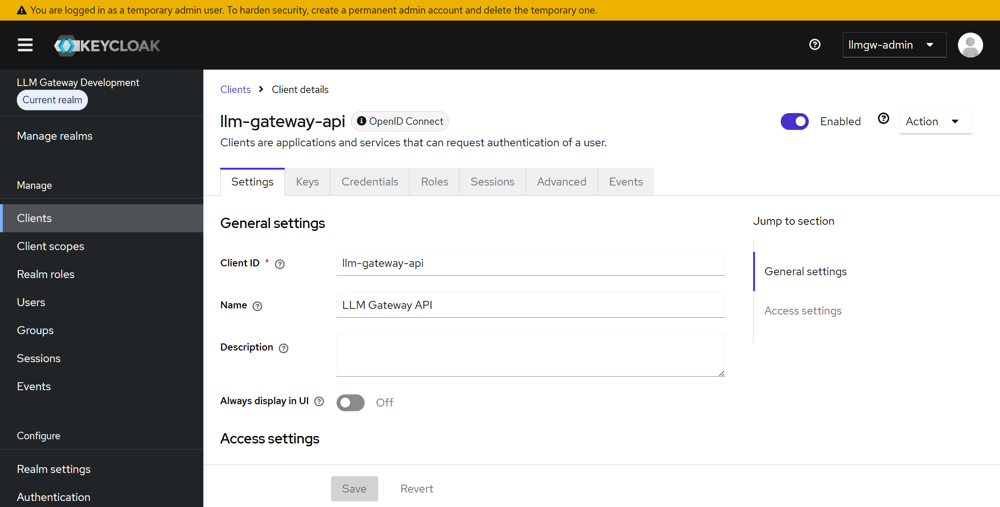

**Clients → llm-gateway-api → Roles → Create role**에서 다음 역할을 생성합니다.

| 항목 | 값 |
|---|---|
| Role name | `invoke` |
| Description | Gateway 호출 권한을 설명하는 문구 |

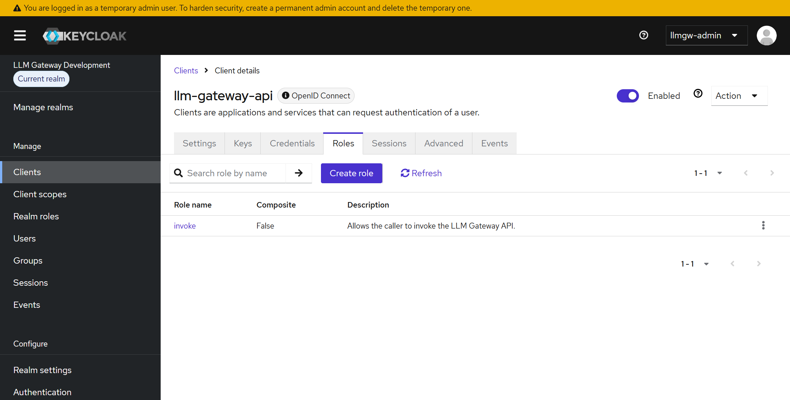

## 3. Gateway client scope 생성

**Client scopes → Create client scope**에서 다음 scope를 생성합니다.

| 항목 | 값 |
|---|---|
| Name | `llm-gateway` |
| Protocol | `OpenID Connect` |
| Type | `None` |
| Include in token scope | `On` |
| Display on consent screen | 조직 정책에 따라 선택 |

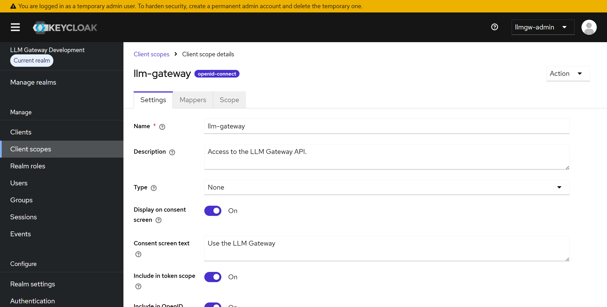

이 scope에 audience, username, client role mapper 세 개를 추가합니다.

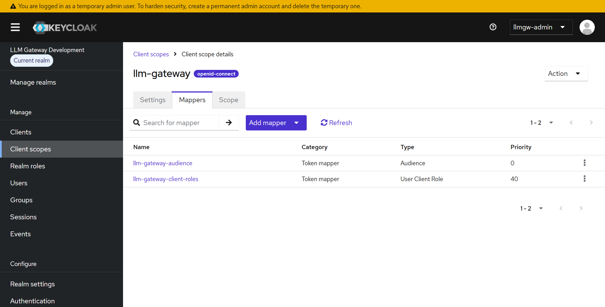

위 기존 화면의 audience와 client role mapper에 아래 username mapper를 추가하면 최종 세 개가
됩니다.

### Audience mapper

**Client scopes → llm-gateway → Mappers → Add mapper → By configuration → Audience**에서
다음과 같이 설정합니다.

| 항목 | 값 |
|---|---|
| Name | `llm-gateway-audience` |
| Included Client Audience | `llm-gateway-api` |
| Add to ID token | `Off` |
| Add to access token | `On` |

이 mapper가 access token의 `aud`에 `llm-gateway-api`를 추가합니다.

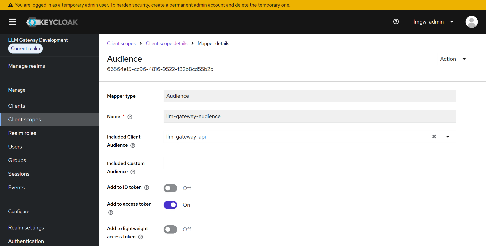

### Username mapper

**Client scopes → llm-gateway → Mappers → Add mapper → By configuration → User Property**에서
다음과 같이 설정합니다.

| 항목 | 값 |
|---|---|
| Name | `llm-gateway-user-label` |
| Property | `username` |
| Token Claim Name | `llm_gateway_user` |
| Claim JSON Type | `String` |
| Add to ID token | `Off` |
| Add to access token | `On` |
| Add to userinfo | `Off` |

이 mapper는 Workbook 표시용 username을 access token에 추가합니다. APIM의 집계와 사용자별
제한은 계속 `iss:sub` 해시를 사용하므로 username 변경이 과거 집계를 분리하지 않습니다.

### User Client Role mapper

**Client scopes → llm-gateway → Mappers → Add mapper → By configuration → User Client Role**에서
다음과 같이 설정합니다.

| 항목 | 값 |
|---|---|
| Name | `llm-gateway-client-roles` |
| Client ID | `llm-gateway-api` |
| Client Role prefix | 비움 |
| Multivalued | `On` |
| Token Claim Name | `llm_gateway_roles` |
| Claim JSON Type | `String` |
| Add to ID token | `Off` |
| Add to access token | `On` |

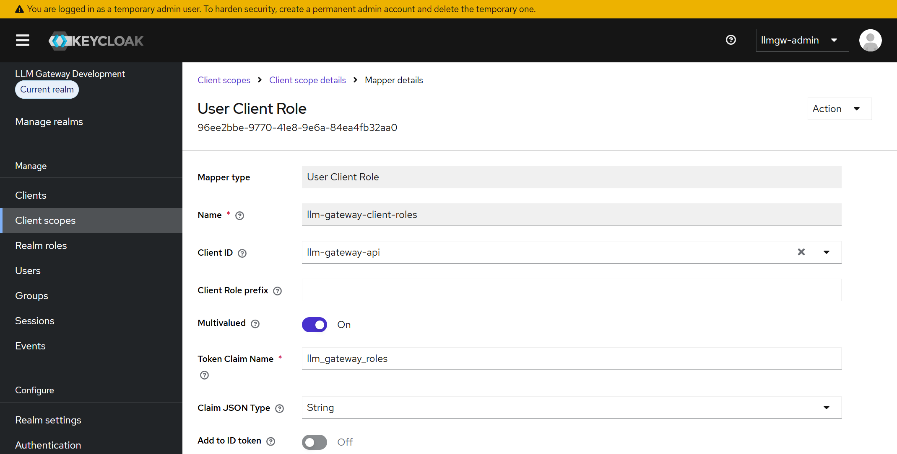

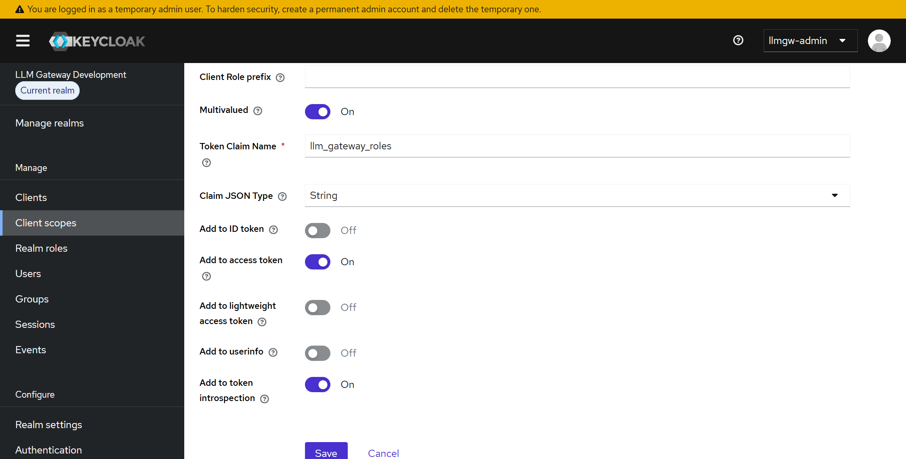

## 4. Client scope에 API 역할 연결

**Client scopes → llm-gateway → Scope → Assign role**에서
`Filter by clients`를 선택하고 `llm-gateway-api / invoke`를 할당합니다.

이 단계가 없으면 사용자가 `invoke` 역할을 보유해도 `fullScopeAllowed=Off`인 CLI client의
access token에 `llm_gateway_roles`가 생성되지 않습니다.

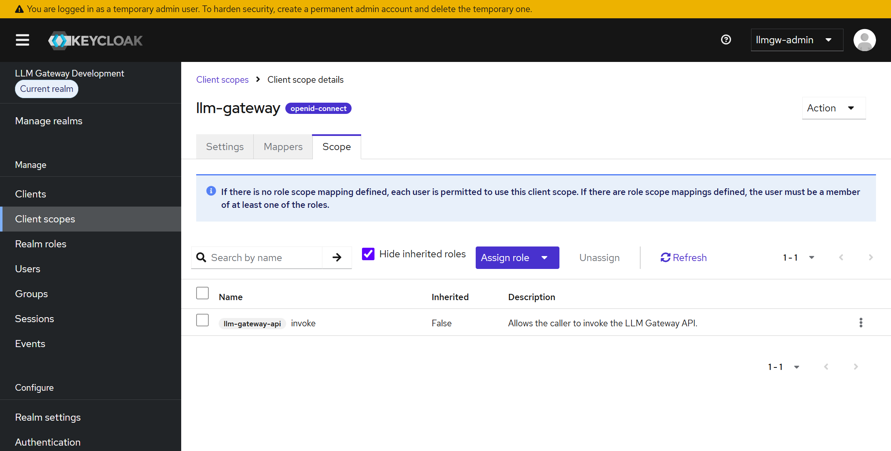

## 5. Device Flow용 CLI client 생성

**Clients → Create client**에서 다음 client를 생성합니다.

| 항목 | 값 |
|---|---|
| Client type | `OpenID Connect` |
| Client ID | `llm-gateway-cli` |
| Name | 설명용 이름, 예: `LLM Gateway CLI` |

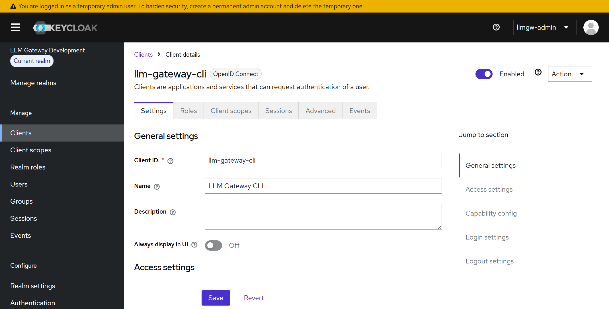

**Clients → llm-gateway-cli → Settings → Capability config**를 다음과 같이 구성합니다.

| 항목 | 값 |
|---|---|
| Client authentication | `Off` |
| Standard flow | `Off` |
| Direct access grants | `Off` |
| Implicit flow | `Off` |
| Service account roles | `Off` |
| OAuth 2.0 Device Authorization Grant | `On` |

Device Flow public client에는 client secret과 redirect URI가 필요하지 않습니다.

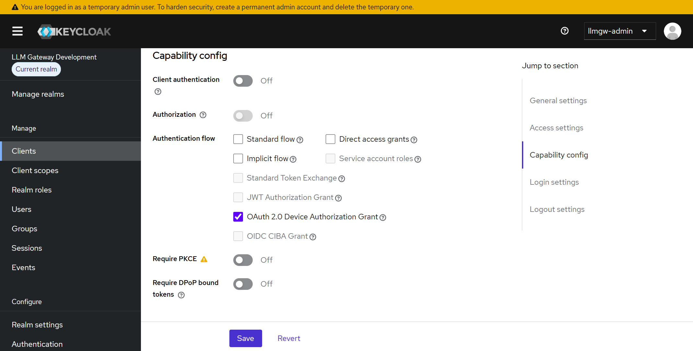

## 6. CLI client에 Gateway scope 연결

**Clients → llm-gateway-cli → Client scopes → Add client scope**에서 `llm-gateway`를 추가하고
Assigned type을 `Optional`로 지정합니다. CLI는 로그인할 때 `openid llm-gateway`를 요청해야
합니다.

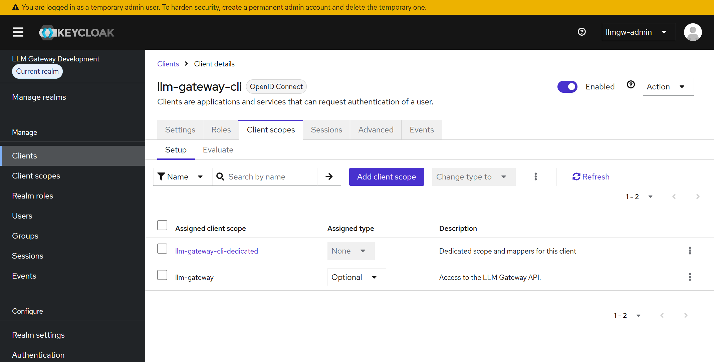

같은 화면에서 `llm-gateway-cli-dedicated`를 열고 **Scope** 탭의
**Full scope allowed**를 `Off`로 설정합니다. 필요한 역할만 앞 단계의 명시적 scope mapping으로
허용합니다.

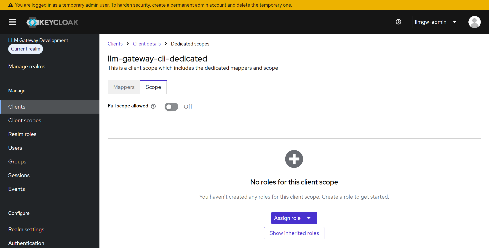

## 7. 기존 사용자 또는 그룹에 invoke 역할 할당

운영 환경에서는 개별 사용자보다 기존 고객 그룹에 역할을 연결하는 방식을 권장합니다.

- 그룹: **Groups → 대상 그룹 → Role mapping → Assign role**
- 사용자: **Users → 대상 사용자 → Role mapping → Assign role**

`Filter by clients`에서 `llm-gateway-api / invoke`를 선택합니다. 그룹에 할당하면 그룹 구성원이
역할을 상속합니다.

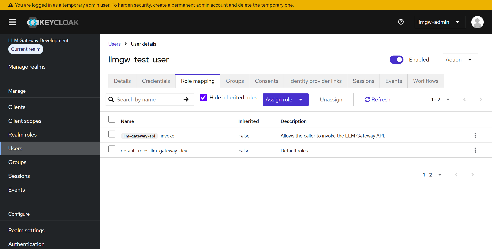

## 8. 토큰 확인

**Clients → llm-gateway-cli → Client scopes → Evaluate**에서 권한이 있는 사용자를 선택하고
access token을 확인합니다. 실제 Device Flow 로그인으로 새 토큰을 발급해 확인해도 됩니다.

최종 access token에는 최소한 다음 값이 있어야 합니다.

```json
{
  "aud": [
    "llm-gateway-api"
  ],
  "scope": "openid llm-gateway",
  "llm_gateway_user": "alice",
  "llm_gateway_roles": [
    "invoke"
  ]
}
```

| 누락된 값 | 확인할 Keycloak 설정 |
|---|---|
| `aud` | `llm-gateway-audience` mapper와 Add to access token |
| `scope` | CLI client의 optional scope 연결과 CLI 요청 scope |
| `llm_gateway_user` | `llm-gateway-user-label` User Property mapper와 Add to access token |
| `llm_gateway_roles` | 사용자/그룹 역할, User Client Role mapper, client scope의 Scope role mapping |

설정을 변경하기 전에 발급한 access token은 내용이 바뀌지 않습니다. OpenCode 같은 CLI를 완전히
종료하고 새 Device Flow 로그인을 수행합니다.

## 9. APIM 운영자에게 전달할 값

Keycloak 관리자는 다음 값을 APIM 운영자에게 전달합니다. 비밀번호, client secret, access token은
전달하지 않습니다.

| 항목 | 값 |
|---|---|
| Issuer | `https://<keycloak-host>/realms/<realm>` |
| Discovery URL | `https://<keycloak-host>/realms/<realm>/.well-known/openid-configuration` |
| Audience | `llm-gateway-api` |
| CLI client ID | `llm-gateway-cli` |
| Requested scope | `openid llm-gateway` |
| Required scope claim | `scope=llm-gateway` |
| Required role claim | `llm_gateway_roles=invoke` |
| User label claim | `llm_gateway_user` |

APIM은 HTTPS discovery와 JWKS endpoint에 접근할 수 있어야 합니다. APIM 측에서는
`validate-jwt` 정책에 issuer, audience와 required claims를 별도로 설정합니다.
username은 Azure Monitor trace에 표시용 `userLabel`로 저장되므로 Log Analytics와 Workbook
접근 권한 및 보존 기간을 조직의 개인정보 정책에 맞게 제한합니다.

## 참고 문서

- [Keycloak Server Administration Guide](https://www.keycloak.org/docs/latest/server_admin/)
- [Keycloak Client Scopes](https://www.keycloak.org/docs/latest/server_admin/#_client_scopes)
- [Azure API Management validate-jwt 정책](https://learn.microsoft.com/azure/api-management/validate-jwt-policy)
